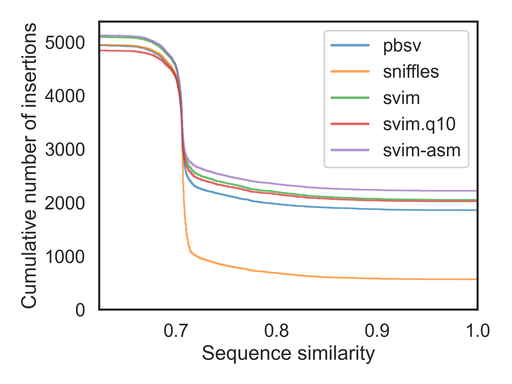
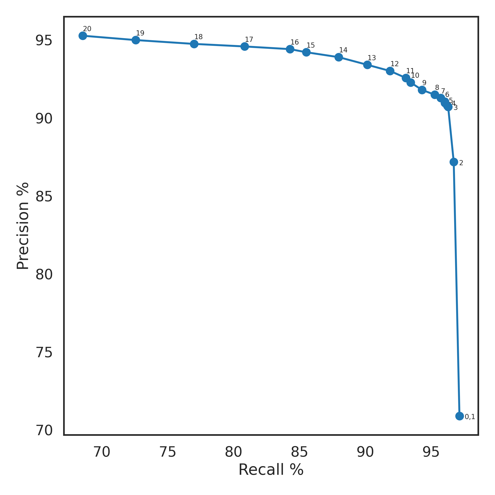

# HPP Year 1 Variant Calling

This repository holds Docker build scripts, workflows and benchmarks for variant calling
used by the [Human Pangenome Project](https://humanpangenome.org).

# Alignments w.r.t. References

Reads/assemblies are aligned to the following reference genomes:

- [`GRCh38_no_alt`](ftp://ftp.ncbi.nlm.nih.gov/genomes/all/GCA/000/001/405/GCA_000001405.15_GRCh38/seqs_for_alignment_pipelines.ucsc_ids/GCA_000001405.15_GRCh38_no_alt_analysis_set.fna.gz): GRCh38 without ALT contigs

- [`CHM13Y_EBV`](https://g-f20d48.ad0e3.03c0.data.globus.org/CHM13Y_EBV_v1.1.fasta.gz): [CHM13 v1.1](https://s3-us-west-2.amazonaws.com/human-pangenomics/T2T/CHM13/assemblies/chm13.draft_v1.1.fasta.gz) + chrY and chrEBV from `GRCh38_no_alt` 

## HiFi-to-Reference Alignments

1. Compute high frequency k-mers in a reference genome using [meryl](https://github.com/marbl/meryl)

   ```sh
   #GRCh38_no_alt
   $ meryl count k=15 output merylDB GCA_000001405.15_GRCh38_no_alt_analysis_set.fa
   $ meryl print greater-than distinct=0.9998 merylDB > GCA_000001405.15_GRCh38_no_alt_analysis_set_repetitive_k15.txt

   #CHM13Y_EBV
   $ meryl count k=15 output merylDB CHM13Y_EBV_v1.1.fasta
   $ meryl print greater-than distinct=0.9998 merylDB > CHM13Y_EBV_v1.1_repetitive_k15.txt
   ```

2. For each movie, align the HiFi reads using Winnowmap v2.03 and sort alignments by coordinates using SAMtools 

   ```sh
   $ winnowmap -W ${MERYLFILE} -t ${THREADS} \
               -R "@RG\tID:${RGID}\tPL:PACBIO\tDS:READTYPE=CCS\tPU:${MOVIE}\tSM:${SAMPLE}\tPM:SEQUEL" \
               -x map-pb -a -Y -L --eqx --cs ${REFFASTA} ${FASTQ} \
     | samtools sort -m4G -@ ${THREADS} -o ${SAMPLE}.${MOVIE}.${REF}.bam
   ```

3. Merge alignments, add MD tags, and index aligments using SAMtools

   ```sh
   $ samtools merge -@ ${THREADS} ${SAMPLE}.${REF}.merged.bam ${BAMFILES} \
     && samtools calmd -b -@ ${THREADS} ${SAMPLE}.${REF}.merged.bam ${REFFASTA} > ${SAMPLE}.${REF}.bam \
     && samtools index -@ ${THREADS} ${SAMPLE}.${REF}.bam
   ```

## ONT-to-Reference Alignments

1. Compute high frequency k-mers in a reference genome using [meryl](https://github.com/marbl/meryl)

   ```sh
   #GRCh38_no_alt
   $ meryl count k=15 output merylDB GCA_000001405.15_GRCh38_no_alt_analysis_set.fa
   $ meryl print greater-than distinct=0.9998 merylDB > GCA_000001405.15_GRCh38_no_alt_analysis_set_repetitive_k15.txt

   #CHM13Y_EBV
   $ meryl count k=15 output merylDB CHM13Y_EBV_v1.1.fasta
   $ meryl print greater-than distinct=0.9998 merylDB > CHM13Y_EBV_v1.1_repetitive_k15.txt
   ```

2. For each flow cell, align the ONT reads using Winnowmap v2.03 and sort alignments by coordinates using SAMtools 

   ```sh
   $ winnowmap -W ${MERYLFILE} -t ${THREADS} \
               -R "@RG\tID:${RGID}\tPL:ONT\tSM:${SAMPLE}" \
	       -x map-ont -a -Y -L --eqx --cs ${REFFASTA} ${FASTQ} \
     | samtools sort -m4G -@ ${THREADS} -o ${RGID}.${REF}.bam
   ```

3. Merge alignments, add MD tags, and index aligments using SAMtools

   ```sh
   $ samtools merge -@ ${THREADS} ${SAMPLE}.${REF}.merged.bam ${BAMFILES} \
     && samtools calmd -b -@ ${THREADS} ${SAMPLE}.${REF}.merged.bam ${REFFASTA} > ${SAMPLE}.${REF}.bam \
     && samtools index -@ ${THREADS} ${SAMPLE}.${REF}.bam
   ```

## Assembly-to-Reference Alignments

Align paternal and maternal assemblies using minimap2 v2.21

   ```sh
   # paternal
   $ minimap2 -x asm5 -a --eqx --cs -t ${THREADS} ${REFFASTA} ${SAMPLE}.paternal.f1_assembly_v2_genbank.fa \
     | samtools sort --write-index -m4G -@ ${THREADS} -o ${SAMPLE}.paternal.${REF}.bam##idx##${SAMPLE}.paternal.${REF}.bam.bai
   
   # maternal
   $ minimap2 -x asm5 -a --eqx --cs -t ${THREADS} ${REFFASTA} ${SAMPLE}.maternal.f1_assembly_v2_genbank.fa \
     | samtools sort --write-index -m4G -@ ${THREADS} -o ${SAMPLE}.maternal.${REF}.bam##idx##${SAMPLE}.maternal.${REF}.bam.bai
   ```

# Small Variant Calling

## Run DeepVariant (First Pass)

Docker image: `google/deepvariant:1.1.0`

```sh
$ run_deepvariant --model_type PACBIO \
                  --ref GCA_000001405.15_GRCh38_no_alt_analysis_set.fa \
                  --reads hifi_alignments/HG002.GRCh38_no_alt.bam \
                  --output_gvcf calls/deepvariant/HG002.GRCh38_no_alt.deepvariant1.g.vcf.gz \
                  --output_vcf calls/deepvariant/HG002.GRCh38_no_alt.deepvariant1.vcf.gz \
                  --num_shards 16 \
                  --call_variants_extra_args "use_openvino=true"
```

## Run whatshap

Docker image: `wwliao/hpp_whatshap:1.0.0--4423f2ed9c728c3e569482b5693006e467a3a596`

```sh
$ whatshap phase --output calls/deepvariant/HG002.deepvariant1.phased.vcf.gz \
                 --reference GCA_000001405.15_GRCh38_no_alt_analysis_set.fa \
                 calls/deepvariant/HG002.GRCh38_no_alt.deepvariant1.vcf.gz \
                 hifi_alignments/HG002.GRCh38_no_alt.bam \
  && bcftools index -t calls/deepvariant/HG002.deepvariant1.phased.vcf.gz \
  && whatshap haplotag --output calls/deepvariant/HG002.GRCh38_no_alt.haplotagged.bam \
                       --reference GCA_000001405.15_GRCh38_no_alt_analysis_set.fa \
                       calls/deepvariant/HG002.deepvariant1.phased.vcf.gz \
                       hifi_alignments/HG002.GRCh38_no_alt.bam \
  && samtools index calls/deepvariant/HG002.GRCh38_no_alt.haplotagged.bam
```

## Run DeepVariant (Second Pass)

Docker image: `google/deepvariant:1.1.0`

```sh
$ run_deepvariant --model_type PACBIO \
                  --ref GCA_000001405.15_GRCh38_no_alt_analysis_set.fa \
                  --reads calls/deepvariant/HG002.GRCh38_no_alt.haplotagged.bam \
                  --use_hp_information \
                  --output_gvcf calls/deepvariant/HG002.GRCh38_no_alt.deepvariant.g.vcf.gz \
                  --output_vcf calls/deepvariant/HG002.GRCh38_no_alt.deepvariant.vcf.gz \
                  --num_shards 16 \
                  --call_variants_extra_args "use_openvino=true"
```

# SV Calling

## Run pbsv

To increase pbsv calling performance, it is recommended to provide a tandem repeat annotation in BED format.

- [TRF BED for GRCh38 no alt](https://github.com/wwliao/hpp_variant_calling/blob/main/annotations/GRCh38_no_alt.trf.bed)
- [TRF BED for CHM13 v1.1 + chrY + EBV](https://github.com/wwliao/hpp_variant_calling/blob/main/annotations/CHM13Y_EBV.trf.bed)

Docker image: `wwliao/hpp_pbsv:1.0.0--5ac93f8f6bd021a33feeb3fbca50466f27847b15`

```sh
$ pbsv discover -s HG002 \
                --tandem-repeats GRCh38_no_alt.trf.bed \
                hifi_alignments/HG002.GRCh38_no_alt.bam \
                calls/pbsv/outputs/HG002.GRCh38_no_alt.svsig.gz \
  && pbsv call --ccs \
               --preserve-non-acgt \
               -t DEL,INS,INV,DUP,BND \
               -m 40 \
               -j 12 \
               GCA_000001405.15_GRCh38_no_alt_analysis_set.fa \
               calls/pbsv/outputs/HG002.GRCh38_no_alt.svsig.gz \
               calls/pbsv/HG002.GRCh38_no_alt.pbsv.vcf \
  && bcftools sort -m4G \
                   -Oz \
                   -o calls/pbsv/HG002.GRCh38_no_alt.pbsv.vcf.gz \
                   calls/pbsv/HG002.GRCh38_no_alt.pbsv.vcf \
  && bcftools index -t calls/pbsv/HG002.GRCh38_no_alt.pbsv.vcf.gz \
  && rm calls/pbsv/HG002.GRCh38_no_alt.pbsv.vcf
```

## Run Sniffles and Iris

Docker image: `wwliao/hpp_sniffles:1.0.0--de39905b020c976bbebdd99d32c5df9b2c812ab4`

```sh
$ sniffles -s 4 \
           -l 40 \
           -n -1 \
           --cluster \
           --ccs_reads \
           -t 12 \
           -m hifi_alignments/HG002.GRCh38_no_alt.bam \
           -v calls/sniffles/outputs/HG002.GRCh38_no_alt.sniffles.raw.vcf \
  && echo HG002 > HG002.txt \
  && bcftools reheader -s HG002.txt \
                       -o calls/sniffles/outputs/HG002.GRCh38_no_alt.sniffles.unrefined.vcf \
                       calls/sniffles/outputs/HG002.GRCh38_no_alt.sniffles.raw.vcf \
  && rm HG002.txt calls/sniffles/outputs/HG002.GRCh38_no_alt.sniffles.raw.vcf \
  && iris genome_in=GCA_000001405.15_GRCh38_no_alt_analysis_set.fa \
          vcf_in=calls/sniffles/outputs/HG002.GRCh38_no_alt.sniffles.unrefined.vcf \
          reads_in=hifi_alignments/HG002.GRCh38_no_alt.bam \
          vcf_out=calls/sniffles/HG002.GRCh38_no_alt.sniffles.vcf \
          threads=12 \
          out_dir=calls/sniffles/tmp/HG002 \
          --also_deletions \
          --hifi \
	  --rerunracon \
          --keep_long_variants \
  && bcftools sort -m4G \
                   -Oz \
                   -o calls/sniffles/HG002.GRCh38_no_alt.sniffles.vcf.gz \
                   calls/sniffles/HG002.GRCh38_no_alt.sniffles.vcf \
  && bcftools index -t calls/sniffles/HG002.GRCh38_no_alt.sniffles.vcf.gz \
  && rm -rf calls/sniffles/tmp/HG002 \
  && rm calls/sniffles/HG002.GRCh38_no_alt.sniffles.vcf
```

## Run SVIM

Docker image: `wwliao/hpp_svim:1.0.0--93e7668e2ecd1fc315126e69da862fd365339509`

```sh
$ svim alignment --interspersed_duplications_as_insertions \
                 --read_names \
                 --zmws \
                 --cluster_max_distance 0.5 \
                 --minimum_depth 4 \
                 --min_sv_size 40 \
                 --sample HG002 \
                 calls/svim/outputs/HG002 \
                 hifi_alignments/HG002.GRCh38_no_alt.bam \
                 GCA_000001405.15_GRCh38_no_alt_analysis_set.fa \
  && bcftools sort -Oz \
                   -o calls/svim/HG002.GRCh38_no_alt.svim.vcf.gz \
                   calls/svim/outputs/HG002/variants.vcf \
  && bcftools index -t calls/svim/HG002.GRCh38_no_alt.svim.vcf.gz
```

## Run SVIM-asm

Docker image: `wwliao/hpp_svimasm:1.0.0--896384d810154ae24154f2143fe327e9e57b326a`

```sh
$ svim-asm diploid --interspersed_duplications_as_insertions \
                   --query_names \
                   --min_sv_size 40 \
                   --sample HG002 \
                   calls/svim-asm/outputs/HG002 \
                   asm_alignments/HG002.paternal.GRCh38_no_alt.bam \
                   asm_alignments/HG002.maternal.GRCh38_no_alt.bam \
                   GCA_000001405.15_GRCh38_no_alt_analysis_set.fa \
  && bcftools sort -Oz \
                   -o calls/svim-asm/HG002.GRCh38_no_alt.svim-asm.vcf.gz \
                   calls/svim-asm/outputs/HG002/variants.vcf \
  && bcftools index -t calls/svim-asm/HG002.GRCh38_no_alt.svim-asm.vcf.gz
```

# SV Calling Benchmark

We compare our HG002 SV callsets with the [GIAB v0.6 Tier 1 SV benchmark set
for HG002](https://ftp-trace.ncbi.nlm.nih.gov/giab/ftp/release/AshkenazimTrio/HG002_NA24385_son/NIST_SV_v0.6).
Since the GIAB benchmark set is on GRCh37, we lifted over it to GRCh38:

- [Lifted GIAB v0.6 Tier 1 SV bgzipped VCF file](https://github.com/wwliao/hpp_sv_calling/blob/main/giab/HG002_SVs_Tier1_v0.6.GRCh38.vcf.gz)
- [Lifted GIAB v0.6 Tier 1 high-confidence SV BED file](https://github.com/wwliao/hpp_sv_calling/blob/main/giab/HG002_SVs_Tier1_v0.6.GRCh38.bed)

|Caller|Recall %|Precision %|F1 %|GT-Recall %|GT-Precision %|GT-F1 %|
|:-:|:-:|:-:|:-:|:-:|:-:|:-:|
|[**pbsv**](https://github.com/PacificBiosciences/pbsv)| 95.57| 87.87| 91.56| 95.32| 82.88| 88.66|
|[**Sniffles**](https://github.com/fritzsedlazeck/Sniffles) + [**Iris**](https://github.com/mkirsche/Iris)| 95.29| 93.03| 94.15| 90.28| 42.75| 58.02|
|[**SVIM**](https://github.com/eldariont/svim)| 97.14| 70.87| 81.95| 97.01| 67.75| 79.79|
|[**SVIM**](https://github.com/eldariont/svim)<br>(score >= 10)| 93.43| 92.26| 92.85| 93.24| 89.38| 91.27|
|[**SVIM-asm**](https://github.com/eldariont/svim-asm)| 97.30| 90.84| 93.96| 96.16| 63.06| 76.17|

**Figure 1. Insertion Sequence Similarity**

Note that the sequence similarity is defined as [Levenshtein distance ratio](https://github.com/spiralgenetics/truvari/wiki/Edit-Distance-Ratio-vs-Sequence-Similarity).



## Filter pbsv calls

```sh
$ cat <(zcat HG002.GRCh38_no_alt.pbsv.vcf.gz | grep "^#") \
      <(zcat HG002.GRCh38_no_alt.pbsv.vcf.gz | grep -vE "^#" | grep 'INS\|DEL') \
      | bgzip -c > HG002.GRCh38_no_alt.pbsv.filtered.vcf.gz \
  && bcftools index -t HG002.GRCh38_no_alt.pbsv.filtered.vcf.gz
```

## Filter Sniffles calls

```sh
$ cat <(zcat HG002.GRCh38_no_alt.sniffles.vcf.gz | grep "^#") \
      <(zcat HG002.GRCh38_no_alt.sniffles.vcf.gz | grep -vE "^#" | grep 'INS\|DEL') \
      | bgzip -c > HG002.GRCh38_no_alt.sniffles.filtered.vcf.gz \
  && bcftools index -t HG002.GRCh38_no_alt.sniffles.filtered.vcf.gz
```

## Filter SVIM calls

```sh
$ cat <(zcat HG002.GRCh38_no_alt.svim.vcf.gz | grep "^#") \
      <(zcat HG002.GRCh38_no_alt.svim.vcf.gz | grep -vE "^#" | grep 'INS\|DEL' \
      | awk '{ if($6>='${SCORE}') { print $0 } }') \
      | bgzip -c > HG002.GRCh38_no_alt.svim.filtered.vcf.gz \
  && bcftools index -t HG002.GRCh38_no_alt.svim.filtered.vcf.gz
```

**Figure 2. SVIM Precision-Recall Curve**



## Filter SVIM-asm calls

```sh
$ cat <(zcat HG002.GRCh38_no_alt.svim-asm.vcf.gz | grep "^#") \
      <(zcat HG002.GRCh38_no_alt.svim-asm.vcf.gz | grep -vE "^#" | grep 'INS\|DEL') \
      | bgzip -c > HG002.GRCh38_no_alt.svim-asm.filtered.vcf.gz \
  && bcftools index -t HG002.GRCh38_no_alt.svim-asm.filtered.vcf.gz
```

## Run Truvari on each callset

Docker image: `wwliao/hpp_truvari:1.0.0--9352c3b9ffbe4680b1712ee465acdaec7f6f909f`

```sh
$ truvari bench -f GCA_000001405.15_GRCh38_no_alt_analysis_set.fa \
                -b HG002_SVs_Tier1_v0.6.GRCh38.vcf.gz \
                -c HG002.GRCh38_no_alt.${CALLER}.filtered.vcf.gz \
                --includebed HG002_SVs_Tier1_v0.6.GRCh38.bed \
                -o bench-${CALLER} \
                -r 1000 \
                -p 0.01 \
                --passonly \
                --giabreport
```
